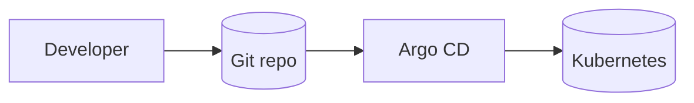

# GitOps Demo Manifests

**Stack skills:** `Kubernetes · Git · GitOps`

> Full portfolio stack: Linux · Docker · Kubernetes · Jenkins · GitLab CI · Ansible · Terraform · Prometheus · Grafana · Zabbix · Nginx · Git · Python · Bash · PowerShell
>
> Hub: https://github.com/qwertqaze102-prog/devops-portfolio-hub


## GitOps flow



```text
Git is source of truth → controller syncs desired state to cluster
```

GitOps-style repository layout (Argo CD / Flux friendly):
- apps split by environment
- image tag updates as commits
- sync waves / basic health annotations

## Idea
Git is source of truth. Cluster controllers sync desired state from this repo.

```text
apps/
  web/
    base/
    overlays/dev|prod
bootstrap/
  argocd-app-of-apps.yaml
```

## Screenshots / how it looks

> Diagrams above show architecture. Run the stack locally and attach UI screenshots here if needed:
> - `docs/screenshots/` folder (optional)
> - keep secrets out of screenshots
